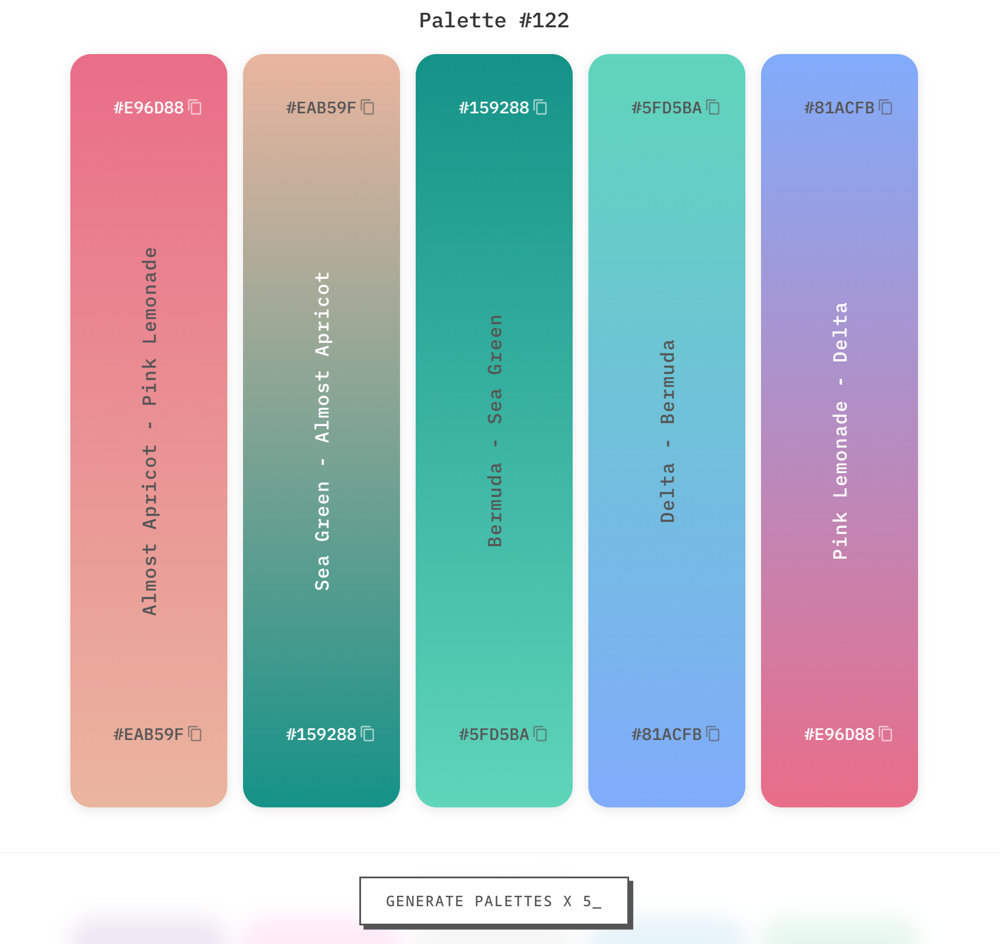

# ChromaFlow - Gradient Palette Generator



## 🌈 About

ChromaFlow is an open-source web tool for generating beautiful gradient color palettes with Pantone-inspired color names. Built in just 2 hours during a live coding session, this project aims to provide designers and developers with an easy way to discover stunning color combinations.

All color names are AI-generated and inspired by:
- Pantone-inspired color library
- Brand colors
- Natural elements
- Creative associations

## ✨ Features

- Generates random gradient palettes with 5 color combinations
- Displays hex codes for easy copying
- Provides Pantone-inspired color names
- Copy color codes with one click
- Infinite scroll loads more palettes as you browse

## 🚀 Usage

1. [Visit the page](http://lathanao.github.io/ChromaFlow)
2. Scroll to generate more palettes automatically
3. Click any hex code to copy it to your clipboard

## 🛠️ Development

This is a pure frontend project built with:
- HTML5
- CSS3 (with modern features like `backdrop-filter`)
- Vanilla JavaScript

### Setup

1. Clone the repository:
   ```bash
   git clone https://github.com/yourusername/chromaflow.git

